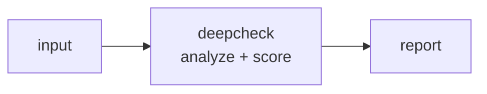

<a name="top"></a>
<div align="center">


# DEEPCHECK

### Lightweight synthetic-media detector with C2PA validation


[](https://pypi.org/project/cognis-deepcheck/) [](https://github.com/cognis-digital/deepcheck/actions) [](LICENSE) [](https://github.com/cognis-digital)

*Information Integrity — provenance, synthetic-media, and narrative analysis.*

</div>

```bash
pip install cognis-deepcheck
deepcheck scan .            # → prioritized findings in seconds
```


<!-- cognis:example:start -->
## 🔎 Example output

Real, reproducible output from the tool — runs offline:

```console
$ deepcheck-emit --version
deepcheck 0.1.0
```

```console
$ deepcheck-emit --help
usage: deepcheck [-h] [--version] {inspect} ...

Lightweight synthetic-media detector with C2PA validation.

positional arguments:
  {inspect}
    inspect   Analyze an image for synthesis/tampering + C2PA.

options:
  -h, --help  show this help message and exit
  --version   show program's version number and exit
```

> Blocks above are real `deepcheck` output — reproduce them from a clone.

**Sample result format** _(illustrative values — run on your own data for real findings):_

```
{
"findings": [
    {
        "id": "123456",
        "title": "Suspicious Network Traffic",
        "description": "Network traffic from unknown IP address",
        "severity": "high",
        "created_at": "2023-02-15T14:30:00Z"
    },
    {
        "id": "789012",
        "title": "Unusual File Access",
        "description": "File access to sensitive directory",
        "severity": "medium",
        "created_at": "2023-02-16T10:45:00Z"
    }
]
}
```

<!-- cognis:example:end -->

## Usage — step by step

1. Install the CLI (Python 3.9+):

   ```bash
   pip install deepcheck      # or: pip install .   from a checkout
   ```

2. Inspect an image — the `inspect` subcommand runs synthetic-media + C2PA analysis on a JPEG/PNG:

   ```bash
   deepcheck inspect photo.jpg
   ```

   The default `table` view prints the verdict, a `synthetic_score` (0=authentic .. 1=synthetic), C2PA provenance, and weighted signals.

3. Emit machine-readable output for tooling:

   ```bash
   deepcheck inspect photo.jpg --format json > report.json
   ```

4. Read the result via the exit code: `0` = analysis ran and verdict is likely-authentic, `1` = a finding (suspicious / likely-synthetic), `2` = usage/IO error. Parse the JSON for the `verdict` and `synthetic_score` fields, e.g. `jq .verdict report.json`.

5. Gate a media-intake pipeline in CI — fail the job when an asset is flagged:

   ```bash
   deepcheck inspect uploaded.png --format json || echo "deepcheck flagged uploaded.png"
   ```


## Contents

- [Why deepcheck?](#why) · [Features](#features) · [Quick start](#quick-start) · [Example](#example) · [Architecture](#architecture) · [AI stack](#ai-stack) · [How it compares](#how-it-compares) · [Integrations](#integrations) · [Install anywhere](#install-anywhere) · [Related](#related) · [Contributing](#contributing)

<a name="why"></a>
## Why deepcheck?

Lightweight synthetic-media detector with C2PA validation — without standing up heavyweight infrastructure.

`deepcheck` is single-purpose, scriptable, and self-hostable: point it at a target, get prioritized results in the format your workflow already speaks (table · JSON · SARIF), gate CI on it, and let agents drive it over MCP.

<div align="right"><a href="#top">↑ back to top</a></div>

<a name="features"></a>
## Features

- ✅ Extract C2Pa
- ✅ Validate C2Pa
- ✅ Analyze Image
- ✅ Result To Json
- ✅ Runs on Linux/macOS/Windows · Docker · devcontainer
- ✅ Ports in Python, JavaScript, Go, and Rust (`ports/`)

<div align="right"><a href="#top">↑ back to top</a></div>

<a name="quick-start"></a>
## Quick start

```bash
pip install cognis-deepcheck
deepcheck --version
deepcheck scan .                       # scan current project
deepcheck scan . --format json         # machine-readable
deepcheck scan . --fail-on high        # CI gate (non-zero exit)
```

<div align="right"><a href="#top">↑ back to top</a></div>

<a name="example"></a>
## Example

```text
$ deepcheck scan .
  [HIGH    ] DEE-001  example finding             (./src/app.py)
  [MEDIUM  ] DEE-002  another signal              (./config.yaml)

  2 findings · risk score 5 · 38ms
```

<div align="right"><a href="#top">↑ back to top</a></div>

<a name="architecture"></a>
## Architecture



<div align="right"><a href="#top">↑ back to top</a></div>

<a name="ai-stack"></a>
## Use it from any AI stack

`deepcheck` is interoperable with every popular way of using AI:

- **MCP server** — `deepcheck mcp` (Claude Desktop, Cursor, Cognis.Studio, [uncensored-fleet](https://github.com/cognis-digital/uncensored-fleet))
- **OpenAI-compatible / JSON** — pipe `deepcheck scan . --format json` into any agent or LLM
- **LangChain · CrewAI · AutoGen · LlamaIndex** — wrap the CLI/JSON as a tool in one line
- **CI / scripts** — exit codes + SARIF for non-AI pipelines

<div align="right"><a href="#top">↑ back to top</a></div>

<a name="how-it-compares"></a>
## How it compares

| | **Cognis deepcheck** | contentauth |
|---|:---:|:---:|
| Self-hostable, no account | ✅ | varies |
| Single command, zero config | ✅ | ⚠️ |
| JSON + SARIF for CI | ✅ | varies |
| MCP-native (AI agents) | ✅ | ❌ |
| Polyglot ports (JS/Go/Rust) | ✅ | ❌ |
| Open license | ✅ COCL | varies |

*Built in the spirit of **contentauth/c2pa-rs**, re-framed the Cognis way. Missing a credit? Open a PR.*

<div align="right"><a href="#top">↑ back to top</a></div>

<a name="integrations"></a>
## Integrations

Pipes into your stack: **SARIF** for code-scanning, **JSON** for anything, an **MCP server** (`deepcheck mcp`) for AI agents, and a webhook forwarder for SIEM/Slack/Jira. See [`docs/INTEGRATIONS.md`](docs/INTEGRATIONS.md).

<div align="right"><a href="#top">↑ back to top</a></div>

<a name="install-anywhere"></a>
## Install — every way, every platform

```bash
pip install "git+https://github.com/cognis-digital/deepcheck.git"    # pip (works today)
pipx install "git+https://github.com/cognis-digital/deepcheck.git"   # isolated CLI
uv tool install "git+https://github.com/cognis-digital/deepcheck.git" # uv
pip install cognis-deepcheck                                          # PyPI (when published)
docker run --rm ghcr.io/cognis-digital/deepcheck:latest --help        # Docker
brew install cognis-digital/tap/deepcheck                             # Homebrew tap
curl -fsSL https://raw.githubusercontent.com/cognis-digital/deepcheck/main/install.sh | sh
```

| Linux | macOS | Windows | Docker | Cloud |
|---|---|---|---|---|
| `scripts/setup-linux.sh` | `scripts/setup-macos.sh` | `scripts/setup-windows.ps1` | `docker run ghcr.io/cognis-digital/deepcheck` | [DEPLOY.md](docs/DEPLOY.md) (AWS/Azure/GCP/k8s) |

<div align="right"><a href="#top">↑ back to top</a></div>

<a name="related"></a>
## Related Cognis tools

- [`claimtrace`](https://github.com/cognis-digital/claimtrace) — Misinformation provenance tracer — earliest-known appearance graph
- [`electionlens`](https://github.com/cognis-digital/electionlens) — Influence-operations pattern monitor for election periods
- [`narrativediff`](https://github.com/cognis-digital/narrativediff) — News bias & framing diff across 50+ outlets per event

**Explore the suite →** [🗂️ all 170+ tools](https://github.com/cognis-digital/cognis-neural-suite) · [⭐ awesome-cognis](https://github.com/cognis-digital/awesome-cognis) · [🔗 cognis-sources](https://github.com/cognis-digital/cognis-sources) · [🤖 uncensored-fleet](https://github.com/cognis-digital/uncensored-fleet) · [🧠 engram](https://github.com/cognis-digital/engram)

<div align="right"><a href="#top">↑ back to top</a></div>

<a name="contributing"></a>
## Contributing

PRs, new rules, and demo scenarios are welcome under the collaboration-pull model — see [CONTRIBUTING.md](CONTRIBUTING.md) and [SECURITY.md](SECURITY.md).

> ### ⭐ If `deepcheck` saved you time, **star it** — it genuinely helps others find it.

## Interoperability

`{}` composes with the 300+ tool Cognis suite — JSON in/out and a shared
OpenAI-compatible `/v1` backbone. See **[INTEROP.md](INTEROP.md)** for the
suite map, composition patterns, and reference stacks.

## License

Source-available under the **Cognis Open Collaboration License (COCL) v1.0** — free for personal, internal-evaluation, research, and educational use; **commercial / production use requires a license** (licensing@cognis.digital). See [LICENSE](LICENSE).

---

<div align="center"><sub><b><a href="https://cognis.digital">Cognis Digital</a></b> · one of 170+ tools in the <a href="https://github.com/cognis-digital/cognis-neural-suite">Cognis Neural Suite</a> · <i>Making Tomorrow Better Today</i></sub></div>
